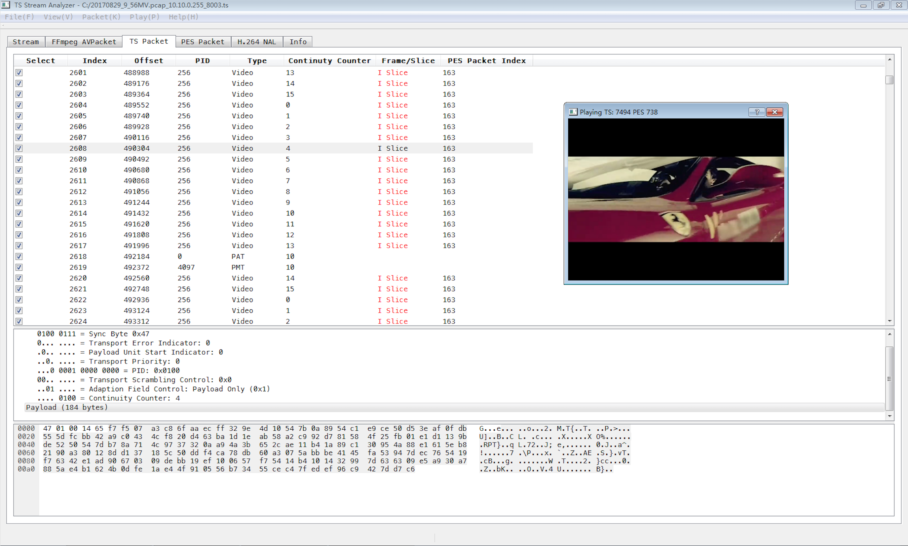

# ts analyzer
A MPEG TS Stream analyzer, base on Qt5, FFmpeg and QtAV.

## Screen shot

## Build
* Pre-requirement: Qt 5.x, QtAV installed
* Build tool: Qt 5.x
* Tested on Windows 7 SP1 x64, Qt 5.7.0, VS2015. Theoritically, ts analyzer support all kinds of platform, not tested yet.

## Version histories

### V0.1, 2017-09-06
* Basic TS stream analyze, support 1 video stream and 1 audio stream.
* FFmpeg AVPacket list, analyze relationship between TS packets.
* PES packet reassembly, PES packet header analyze, PTS/DTS caculation.
* H.264 NAL analyze (Slice type only) and list.
* Stream information statics (base on FFmpeg avformat), TS/PES packet statics, GOP statics.
* Stream playing (base on QtAV), tested renderer Direct2D, decoder FFmpeg.
* TS packet loss simulation, to test network transmission affection on streaming.

## Resource links
* Qt: [https://www.qt.io](https://www.qt.io)
* FFmpeg: [http://www.ffmpeg.org](http://www.ffmpeg.org)
* QtAV: [http://qtav.org](http://qtav.org)
* wireshark: [https://www.wireshark.org](https://www.wireshark.org)

## Contributors
* xuguangxiao, <szgxxu@gmail.com>
